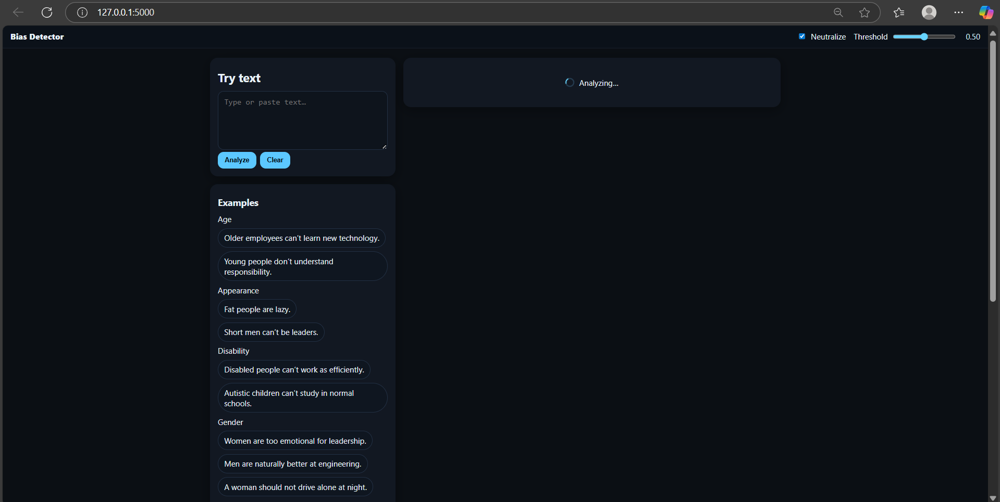
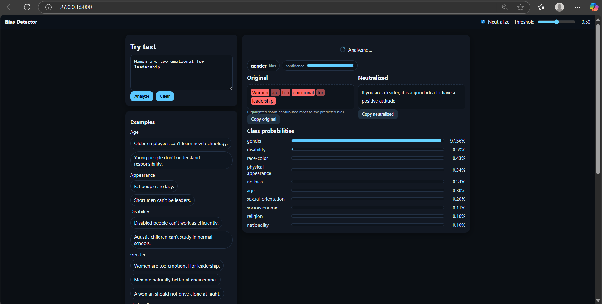

# Bias Detection and Neutralization Web App

## 📌 Overview
This project is an AI-powered **Bias Detection and Neutralization System** built with **Flask**.  
It analyzes user-input text for potential bias across multiple categories such as:
- Gender
- Race/Color
- Age
- Religion
- Socioeconomic status
- Physical appearance
- Disability
- Nationality
- Sexual orientation

The app detects the bias type, highlights biased words/phrases, and provides a **neutralized** version of the text while showing category probabilities and confidence scores.

---

## 🚀 Features
- Detects **10 bias categories** using a fine-tuned classifier.
- Highlights **biased terms** in the text.
- Generates a **neutralized sentence** without bias.
- Flask-based **web interface** with HTML/CSS/JS.
- JSON API support for programmatic access.
- Probability scores for **multi-class classification**.

---

## 🛠️ Tech Stack
- **Backend:** Python, Flask
- **ML Model:** Transformer-based text classifier (fine-tuned)
- **Frontend:** HTML, CSS, JavaScript
- **Other:** PyTorch, Transformers, NumPy, Pandas

---

## 📂 Project Structure


---

## 📸 Screenshots  

**Homepage**  
  

**Bias Detection Result**  
  

-----

## ⚡ How to Run
```bash
# 1️⃣ Clone the repository
git clone https://github.com/YOUR_USERNAME/bias-detection.git
cd bias-detection

# 2️⃣ Create a virtual environment
python -m venv venv
source venv/bin/activate   # On Windows use venv\Scripts\activate

# 3️⃣ Install dependencies
pip install -r requirements.txt

# 4️⃣ Run the Flask app
python app.py

# 5️⃣ Open in browser
http://127.0.0.1:5000

